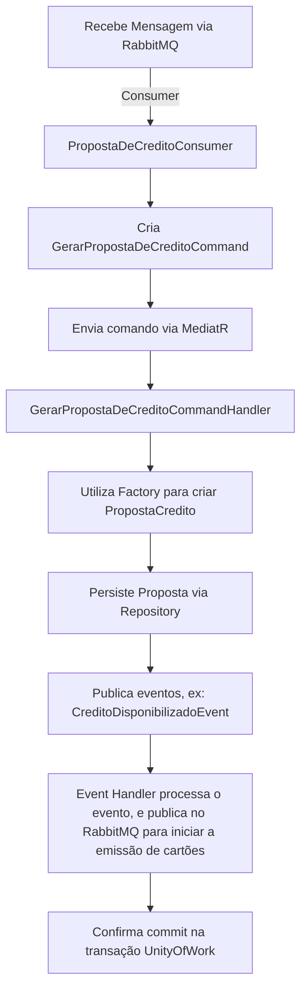

# PB.PropostaDeCredito

Microsserviço de análise de proposta de crédito, responsável por definir se o cliente tem crédito disponível, e dispara o evento para a emissão de cartões.

Este repositório implementa uma solução baseada em uma arquitetura em camadas utilizando os conceitos de DDD e CQRS, e integra componentes via REST API, Consumers, Factory, Repository, Services, Command Handlers, Mediator, Event Source, MassTransit e RabbitMQ.

## Visão Geral

O sistema é dividido em camadas:

- **API:** ([src/api/PB.PropostaDeCredito.Api](src/api/PB.PropostaDeCredito.Api))  
  Exposição de endpoints REST e integração com consumers (ex.: `PropostaDeCreditoConsumer`).
  
- **Application:** ([src/application/PB.PropostaDeCredito.Application](src/application/PB.PropostaDeCredito.Application))  
Responsável pelos command handlers, event handlers e a orquestração dos processos de negócio, utilizando MediatR para a comunicação entre componentes.
  
- **Domain:** ([src/domain/PB.PropostaDeCredito.Domain](src/domain/PB.PropostaDeCredito.Domain))  
Contém a lógica de negócio, entidades, fábricas (Factory) e eventos de domínio.
  
- **Infraestrutura:** ([src/infra/PB.PropostaDeCredito.Infra.Data](src/infra/PB.PropostaDeCredito.Infra.Data))  
Responsável pela persistência de dados e implementação dos repositórios e a implementação da UoW (UnityOfWork).
  
- **Testes:** ([test/PB.PropostaDeCredito.UnityTests](test/PB.PropostaDeCredito.UnityTests))  
  Contém testes unitários utilizando frameworks como xUnit.

## Estrutura do Projeto

```plaintext
PB.PropostaDeCredito.sln
├── .github/
├── dependencies
│   ├── PB.Commons.Api.dll
│   └── PB.Commons.Infra.Kernel.dll
├── src/
│   ├── api/
│   │   └── PB.PropostaDeCredito.Api/
│   │       ├── Consumers/
│   │       ├── Controllers/
│   │       ├── Program.cs
│   │       └── appsettings*.json
│   ├── application/
│   │   └── PB.PropostaDeCredito.Application/
│   │       ├── CommandHandlers/
│   │       └── EventHandler/
│   ├── domain/
│   │   └── PB.PropostaDeCredito.Domain/
│   │       ├── PropostasDeCredito/
│   │       │   ├── Command/
│   │       │   ├── Events/
│   │       │   └── PropostaCredito.cs
│   │       └── ...
│   └── infra/
│       └── PB.PropostaDeCredito.Infra.Data/
│           ├── Context/
│           ├── PropostasDeCredito/
│           └── ...
└── test/
    └── PB.PropostaDeCredito.UnityTests/
        ├── Application/
        └── Domain/
```

## Padrões e Arquitetura Utilizados

- **DDD (Domain-Driven Design):** Separação clara entre as camadas de domínio, aplicação, API e infraestrutura, isolando a complexidade de negócio no domínio.

- **CQRS (Command Query Responsibility Segregation)**: Uso de comandos (ex.: `GerarPropostaDeCreditoCommand`) para as operações de escrita, tratados pelos command handlers.

- **REST API:** Exposição dos endpoints para consumo externo, permitindo a integração entre sistemas.

- **Consumer e MassTransit:** Um consumer, como o `PropostaDeCreditoConsumer`, integra-se ao sistema via RabbitMQ utilizando MassTransit para envio e recepção de mensagens.

- **Factory:** Utilizada para criar instâncias de entidades com regras de negócio.

- **Repository:** Abstração do acesso a dados, utilizando interfaces como `PropostaCreditoRepository`.

- **Services e Command Handler:** Responsáveis por orquestrar a lógica de negócio e a comunicação entre os componentes, utilizando MediatR para gerenciamento de mensagens.

- **Event Sourcing e Eventos de Domínio**: Dispara eventos, como `CreditoDisponibilizadoEvent`, para propagar alterações e acionar lógica adicional.

## Fluxo de Requisição

O fluxo principal de uma requisição para gerar uma proposta de crédito é ilustrado no diagrama abaixo:



Exemplo de criação de uma proposta utilizando a factory:

```csharp
// Exemplo extraído da implementação da Factory
var command = new GerarPropostaDeCreditoCommand {
    ClientId = Guid.NewGuid(),
    Score = 400
};

var proposta = PropostaCredito.Factory.Create(command);
```

## Dependências Externas

- **MassTransit:** Facilita a integração com RabbitMQ.
- **MediatR:** Gerencia a comunicação interna via comandos e eventos.
- **Entity Framework Core:** Utilizado para a persistência dos dados.
- **Bibliotecas Comuns:** DLLs presentes na pasta `dependencies`, como `PB.Commons.Api.dll` e `PB.Commons.Infra.Kernel.dll`.

## Como Executar

1. **Build da Solução:**

   ```sh
   dotnet build PB.PropostaDeCredito.sln
   ```

2. **Iniciar a API:**

   ```sh
   dotnet run --project src/api/PB.PropostaDeCredito.Api/PB.PropostaDeCredito.Api.csproj
   ```

   A API utilizará as configurações definidas nos arquivos `appsettings.json` e `launchSettings.json`.

3. **Executar Testes:**

   No diretório raiz, execute:

   ```sh
   dotnet test test/PB.PropostaDeCredito.UnityTests/PB.PropostaDeCredito.UnityTests.csproj
   ```

## Testes

Os testes unitários utilizam xUnit e FluentAssertions para validar o comportamento das regras de negócio, conforme exemplificado em:

- [test/PB.PropostaDeCredito.UnityTests/Domain](test/PB.PropostaDeCredito.UnityTests/Domain)  (testes de domínio)
- [test/PB.PropostaDeCredito.UnityTests/Application](test/PB.PropostaDeCredito.UnityTests/Application) (testes de aplicação)

Cada teste assegura a correta criação da proposta e a publicação dos eventos correspondentes.

## Resiliência e Configuração do Consumer

Para garantir a confiabilidade no processamento de mensagens, a aplicação utiliza mecanismos de resiliência configurados no MassTransit. Na configuração do consumer, foi implementado os seguintes pontos:

- **Immediate Retry:** São executadas tentativas imediatas (por exemplo, 5 tentativas) para tratar falhas transitórias sem necessidade de redelivery.

- **Delayed Redelivery:** Caso as tentativas imediatas falhem, é aplicado um redelivery escalonado, com intervalos predefinidos (por exemplo, 5s, 15s, 30s), aumentando a chance de sucesso sem sobrecarregar o sistema.

Exemplo de configuração no arquivo de serviços (ServicesExtensions.cs):

```cs
services.AddMassTransit(x =>
{
    cfg.ReceiveEndpoint("queue-name"), e =>
    {
        e.ConfigureConsumer<PropostaDeCreditoConsumer>(context);

        // caso todas as tentativas de reenvio imediato falhem, tenta reenviar a mensagem em 3 intervalos diferentes
        // com 5, 15 e 30 minutos de espera entre cada tentativa
        cfg.UseDelayedRedelivery(r => r.Intervals(TimeSpan.FromMinutes(5), TimeSpan.FromMinutes(15), TimeSpan.FromMinutes(30)));

        // caso de falha na entrega da mensagem, tenta reenviar 5 vezes imediatamente
        cfg.UseMessageRetry(r => r.Immediate(5));
    });
});
```

Com essa estratégia, o sistema tenta processar as mensagens imediatamente e, se necessário, realiza redelivery com intervalos definidos, aumentando a robustez e a confiabilidade da mensageria via RabbitMQ.
